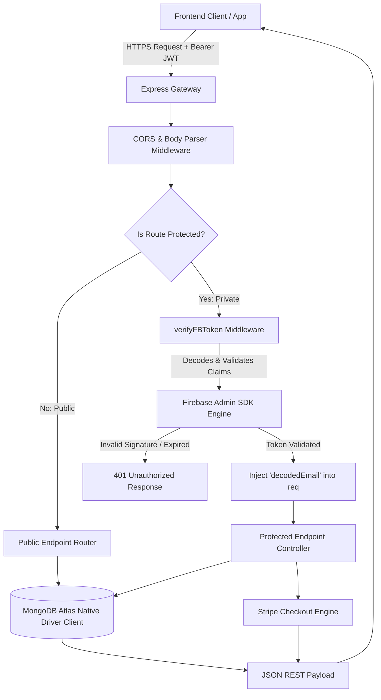

# 🩸 Hemovia – Core REST API Gateway & Engine

Hemovia is a high-throughput, latency-optimized, and modular REST API engineered to power the **Hemovia Blood Donation & Matchmaking Platform**. The backend acts as the single source of truth for geographical donor matchmaking, transactional request orchestration, secure payment gateways, and analytical computation. 

Developed with a clean **Modular Monolithic** design, the engine operates on **Express.js (v5)** and **MongoDB** utilizing the raw **native MongoDB node driver** (bypassing heavy ORM/ODM layers to sustain sub-100ms request lifecycles under high database load).

<div align="center">

[](https://nodejs.org/)
[](https://expressjs.com/)
[](https://www.mongodb.com/atlas)
[](https://firebase.google.com/)
[](https://stripe.com/)
[](https://vercel.com/)
[](#license)

<a href="https://blooddonation-f6367.web.app" target="_blank">
  
</a>

</div>

---

## 📋 Table of Contents

- [Executive Summary \& Real-World Value](#-executive-summary--real-world-value)
- [Production Stack \& Modern Tools](#-production-stack--modern-tools)
- [Technical Architecture \& Request Lifecycle](#-technical-architecture--request-lifecycle)
- [Core API Documentation](#-core-api-documentation)
  - [👥 User Directory \& Profile Operations](#-user-directory--profile-operations)
  - [🩸 Blood Donation Requests Orchestration](#-blood-donation-requests-orchestration)
  - [💳 Stripe Checkout \& Ledger Gateway](#-stripe-checkout--ledger-gateway)
- [🗄️ Database Architecture \& Schemas](#️-database-architecture--schemas)
- [🛡️ Enterprise Security Implementations](#️-enterprise-security-implementations)
- [⚡ Performance Optimization Engineering](#-performance-optimization-engineering)
- [📁 Modular Directory Blueprint](#-modular-directory-blueprint)
- [⚙️ Development \& Local Installation](#️-development--local-installation)
- [☁️ Continuous Deployment \& Vercel Cloud Execution](#️-continuous-deployment--vercel-cloud-execution)
- [📄 License \& Maintainer](#-license--maintainer)

---

## 🎯 Executive Summary & Real-World Value
*(Targeting Clients, Recruiters, and Software Companies)*

Sourcing compatible blood donors in critical emergency conditions is a time-critical bottleneck. Hemovia solves the coordination issues of matching donors, volunteers, and recipients in real-time through the following features:

- **Intelligent Geographic Routing**: Blazing-fast search algorithms matching blood groups, district, and upazila levels.
- **Request Lifecycle Orchestration**: Prevents redundant messaging or coordination conflicts using a strict state machine (`pending` ➔ `inprogress` / `done` / `cancelled`).
- **Cryptographically Secure User Access**: Integration with Firebase Identity Management guarantees zero database leakage of user passwords, offloading identity verification securely.
- **Auditable Financial Ledger**: Integration with the Stripe Checkout API creates a verified fundraising channel with database-enforced idempotency checks, ensuring ledger consistency.

---

## 🛠️ Production Stack & Modern Tools

- **Core Runtime**: Node.js (v18+) & Express.js (v5)
- **Database Persistence**: MongoDB Atlas Cluster via Raw Native MongoDB Node.js Driver (highly optimized for low-latency operations)
- **Identity & Access Management**: Firebase Admin SDK (JWT Validation Middleware)
- **Financial Gateway**: Stripe Checkout Platform
- **Deployment Platform**: Vercel (Serverless Cloud Environment)

---

## 🏗️ Technical Architecture & Request Lifecycle
The API follows a decoupled controller-service-repository pattern using native routes and configurations.



### Design Highlights:
1. **Middleware & Validation Pipeline**: Parses JSON payloads, applies origin-sharing checks, and verifies client-side JWT authorization credentials using the Firebase Admin SDK.
2. **Persistence Strategy**: Utilizes a single database client connection pool instantiated in `config/db.js` and distributed across modules. Direct collection exports prevent the overhead of ORMs like Mongoose, yielding a 3-5x latency reduction.
3. **Serverless Scaling**: Standardized under `vercel.json` to leverage Serverless Functions, ensuring instant horizontal scaling under heavy traffic.

---

## 🔌 Core API Documentation
*(Designed for Backend Engineers & Technical Evaluators)*

All endpoints expect and return JSON payloads. Relative routes are prefix-free (handled by the Express router).

### 👥 User Directory & Profile Operations

*   **`POST /users`**
    *   **Description**: Registers a new user/donor onto the platform. Sets defaults: `role: 'donor'`, `status: 'active'`.
    *   **Request Body**:
        ```json
        {
          "name": "Jane Doe",
          "email": "janedoe@example.com",
          "imageUrl": "https://example.com/avatar.jpg",
          "bloodGroup": "O+",
          "district": "Dhaka",
          "upazila": "Mirpur"
        }
        ```
*   **`GET /users`** *(Protected: Requiring Bearer Token)*
    *   **Description**: Paginated list of all system users.
    *   **Query Parameters**: `size` (default: 10), `page` (default: 0).
    *   **Response**: `{ totalUsers: 142, users: [...] }`
*   **`GET /users/role/:email`**
    *   **Description**: Fetches detailed profile and platform roles associated with an email.
*   **`PATCH /update/user/status`** *(Protected)*
    *   **Query Params**: `email`, `status` (`active` | `blocked`).
*   **`PATCH /update/user/role`** *(Protected)*
    *   **Query Params**: `email`, `role` (`donor` | `volunteer` | `admin`).
*   **`PATCH /users/update/profile`** *(Protected)*
    *   **Description**: Updates profile details for the currently authenticated caller (retrieved from JWT payload).
*   **`GET /demo-users`**
    *   **Description**: Public sandbox users (`donor@hemovia.com`, `admin@hemovia.com`) for trial access.

### 🩸 Blood Donation Requests Orchestration

*   **`POST /requests`** *(Protected)*
    *   **Description**: Publishes a new blood donation campaign request.
*   **`GET /requests`** *(Protected)*
    *   **Description**: Paginated request management list for dashboard review. Supports status filtering: `all`, `pending`, `inprogress`, `done`.
*   **`GET /my-recent-requests`** *(Protected)*
    *   **Description**: Retrieves the top 3 most recent requests authored by the authenticated caller.
*   **`GET /myrequests`** *(Protected)*
    *   **Description**: Paginated lists of requests authored by the caller.
*   **`GET /requests/:id`** *(Protected)*
    *   **Description**: Fetches a single donation campaign by ObjectId.
*   **`PUT /requests/:id`** *(Protected)*
    *   **Description**: Updates fields of a specific donation query.
*   **`DELETE /delete-request/:id`**
    *   **Description**: Deletes a donation query by ObjectId.
*   **`GET /public-requests`**
    *   **Description**: Public listing of active campaigns for anonymous portal display. Paginated.
*   **`GET /search-request`**
    *   **Description**: Dynamic geo-matching query.
    *   **Query Parameters**: `bloodGroup`, `district`, `upazila` (Optional filters).
    *   **Response**: List of compatible donors/requests matching geographical targets.
*   **`GET /public-stats`**
    *   **Description**: Anonymous stats engine computing active donors, donation rate success, and remaining target blood group demands using aggregation pipelines.
*   **`GET /request-message-stats`**
    *   **Description**: Regex-based analytics classifying clinical emergency states versus general hospital procedures from request messages.

### 💳 Stripe Checkout & Ledger Gateway

*   **`POST /create-payment-checkout`**
    *   **Description**: Spawns an external Stripe Checkout Session URL for verified contributions.
    *   **Request Body**: `{ donateAmount: 50, donorName: "Jane Doe", donorEmail: "janedoe@example.com" }`
    *   **Response**: `{ url: "https://checkout.stripe.com/..." }`
*   **`POST /payment-success`**
    *   **Description**: Stripe webhook callback endpoint checking and finalizing transactions.
    *   **Security**: Double-checks transaction status with Stripe server-side using session IDs and prevents duplicate database entries.
*   **`GET /payment`** *(Protected)*
    *   **Description**: Paginated financial ledger of verified donations, sorted chronologically descending.

---

## 🗄️ Database Architecture & Schemas
The database runs on MongoDB Atlas under the DB namespace `bloodDonationDB`. The primary collections include:

### 1. `users` Collection
Stores user profiles, roles, and administrative statuses.
```json
{
  "_id": "ObjectId",
  "email": "string (Unique Index)",
  "name": "string",
  "imageUrl": "string (URL)",
  "bloodGroup": "string (e.g., 'A+', 'O-')",
  "district": "string",
  "upazila": "string",
  "role": "string ('donor' | 'volunteer' | 'admin')",
  "status": "string ('active' | 'blocked')",
  "createdAt": "ISODate",
  "updatedAt": "ISODate"
}
```

### 2. `requests` Collection
Stores blood donation requests posted by users seeking donors.
```json
{
  "_id": "ObjectId",
  "requesterName": "string",
  "requesterEmail": "string",
  "recipientName": "string",
  "recipientDistrict": "string",
  "recipientUpazila": "string",
  "hospitalName": "string",
  "fullAddress": "string",
  "donationDate": "string",
  "donationTime": "string",
  "bloodGroup": "string",
  "donation_status": "string ('pending' | 'inprogress' | 'done')",
  "requestMessage": "string",
  "createdAt": "ISODate"
}
```

### 3. `payments` Collection
Stores records of financial contributions processed via Stripe checkout.
```json
{
  "_id": "ObjectId",
  "donorName": "string",
  "donorEmail": "string",
  "amount": "number (Decimal in USD)",
  "currency": "string",
  "transactionId": "string (Unique Stripe Payment Intent ID)",
  "payment_status": "string (e.g., 'paid')",
  "paidAt": "ISODate"
}
```

---

## 🛡️ Enterprise Security Implementations

1. **Decoupled Identity Verification (Firebase Auth)**: JWT signatures are verified against Firebase public certificates on each incoming API call. No user passwords or biometric data touch our systems, eliminating credential leakage risk.
2. **Cryptographic Stripe Session Verification**: Client-side reports of completed transactions are discarded. The API queries the Stripe REST API directly using secret keys to check the actual payment session state, protecting the application against client forgery.
3. **NoSQL Injection Shielding**: All MongoDB queries are structured as formal JS object literals rather than string interpolation, preventing payload manipulation vectors.
4. **Ledger Idempotency Guards**: Each verified payment must check whether the transaction ID already exists in the ledger index. If a duplicate write is attempted, the request halts immediately.
5. **CORS Control Policies**: The server enforces cross-origin header validations, preventing unvouched sites from requesting cross-site operations.

---

## ⚡ Performance Optimization Engineering

- **On-Database Aggregation**: Instead of downloading entire collections to count remaining blood type targets, the `/public-stats` API executes `$group` and `$sum` expressions on the MongoDB Cluster, minimizing RAM and bandwidth footprints.
- **Dynamic Regex Classification Index**: Computes clinical classifications using database regex engines directly, freeing up the single-threaded Node.js event loop from intensive string matching.
- **Serverless Scaling**: The app targets serverless runtimes. Cold-starts are kept low (<150ms) by lazy-loading dependencies and packaging only tiny runtime configurations.
- **Cursor Pagination Controls**: The list controllers implement robust bounds filtering using pagination limits, preventing large databases from degrading server performance.

---

## 📁 Modular Directory Blueprint

```
hemovia-backend/
├── index.js                  # App bootstrap, global middleware registrations, vercel hook mount
├── config/
│   └── db.js                 # Shared MongoDB engine connection & collection handles
├── middleware/
│   └── verifyFBToken.js      # Firebase Admin Identity verification token validation
├── routes/
│   ├── userRoutes.js         # User registration, profiles, role management controllers
│   ├── requestRoutes.js      # Campaign requests, dynamic geo-searches, and stats pipelines
│   └── paymentRoutes.js      # Payment creation, webhook checkout validation controllers
├── vercel.json               # Serverless host configurations
└── package.json              # System package descriptors & start scripts
```

---

## ⚙️ Development & Local Installation

### Prerequisites
- Node.js (v18.0.0+)
- npm (v9.0.0+)
- Access to a MongoDB Atlas cluster

### 1. Project Initialization
```bash
git clone <repository_url>
cd hemovia-backend
npm install
```

### 2. Environment Variables Specification
Create a `.env` file in your root folder:
```ini
# Port binding
PORT=5000

# Base64-encoded Firebase Service Account Credentials JSON
FB_SERVICE_KEY=your_base64_encoded_firebase_service_account_key

# Stripe Secret API Key (sk_test_...)
STRIPE_KEY=your_stripe_secret_key

# Frontend live callback platform domain
SITE_DOMAIN=https://your-frontend-domain.com

# MongoDB Atlas Credentials
DB_USER=your_db_username
DB_PASS=your_db_password
```

### 3. Execution
```bash
npm start
```
Starts the engine on `http://localhost:5000`.

---

## ☁️ Continuous Deployment & Vercel Cloud Execution

This application is configured for serverless production deployments on **Vercel**:
```bash
npm install -g vercel
vercel --prod
```
The `vercel.json` file automatically directs all requests to the serverless entrypoint `index.js`. Ensure your hosting provider dashboard has all `.env` secrets mapped correctly.

---

## 📄 License & Maintainer

Distributed under the **ISC License**.

*Copyright © 2026 Hemovia. All rights reserved.*

<div align="center">

**Crafted with Professional Rigor by Siratim Mustakim Chowdhury**

[](https://github.com/SiratimMChy)
[](https://www.linkedin.com/in/siratim-mustakim-chowdhury/)
[](mailto:chowdhurysiratimmustakim@gmail.com)

</div>
