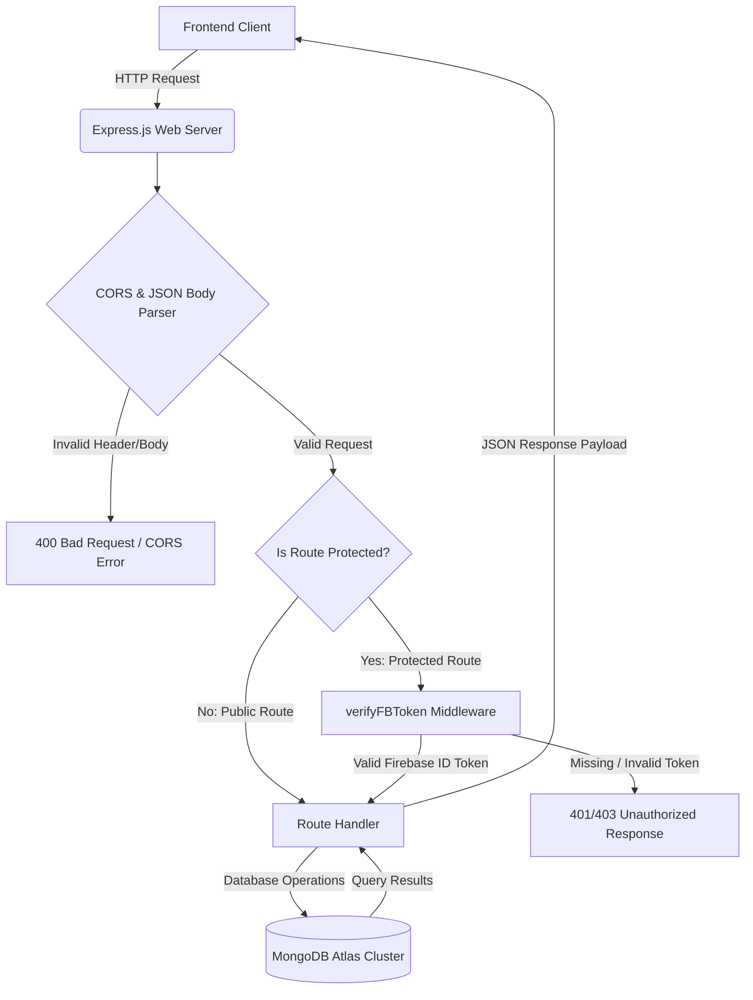

# 🩸 Hemovia – Backend API Engine & Infrastructure

<div align="center">

**A robust, serverless RESTful API gateway driving the Hemovia Blood Donation Management Platform. Engineered for real-time donor matchmaking, secure transaction processing, and administrative controls.**

[](https://nodejs.org/)
[](https://expressjs.com/)
[](https://www.mongodb.com/atlas)
[](https://firebase.google.com/)
[](https://stripe.com/)
[](https://vercel.com/)
[](#license)

<a href="https://blooddonation-f6367.web.app" target="_blank">
  
</a>

</div>

---

## 📋 Table of Contents

- [System Overview & Purpose](#-system-overview--purpose)
- [Real-World Problems Solved](#-real-world-problems-solved)
- [Backend Driven Features](#-backend-driven-features)
- [Technical Architecture & Request Lifecycle](#-technical-architecture--request-lifecycle)
- [Database Architecture & Schema](#-database-architecture--schema)
- [Authentication, Authorization & Security](#-authentication-authorization--security)
- [Environment & Configuration Management](#-environment--configuration-management)
- [Performance & Scalability Optimization](#-performance--scalability-optimization)
- [Project File Structure](#-project-file-structure)
- [Local Setup & Installation](#-local-setup--installation)
- [Production Deployment](#-production-deployment)
- [License & Maintainer](#-license--maintainer)

---

## 🎯 System Overview & Purpose

The **Hemovia Backend** acts as the high-throughput, secure API engine powering the Hemovia Blood Donation Management Platform. Built on a modular monolithic architecture, this service manages:
*   Secure authentication checks against Firebase's identity platform.
*   High-performance query filtering for matching compatible blood donors geographically.
*   State tracking for donor-recipient coordination pipelines.
*   Verified fundraising payment channels using the Stripe Checkout API.

By avoiding heavy Object-Document Mappers (ODMs) like Mongoose, the service interacts with **MongoDB Atlas** using the raw native driver, reducing execution overhead and ensuring minimal response latency under high load.

---

## 🧠 Real-World Problems Solved

During critical medical emergencies (trauma surgeries, childbirth, pregnancy complications, or chronic transfusions), sourcing compatible blood is a time-sensitive bottleneck. The Hemovia API resolves these friction points:

1. **Immediate Donor Location (Geographical Querying)**: By leveraging optimized MongoDB search filters matching blood groups, districts, and upazilas, the backend enables instantaneous search results, drastically lowering the response time during emergency requests.
2. **Request Lifecycle Governance**: Manages dynamic status shifts of requests (`pending` → `inprogress` → `done` / `canceled`) to prevent duplication of volunteer efforts or coordinate donor availability.
3. **Idempotency & Fraud Mitigation in Fundraising**: In the Stripe checkout lifecycle, the backend verifies payment intents and executes database-level checks to prevent duplicate writes for the same transaction ID, ensuring absolute accuracy in financial bookkeeping.
4. **Clinical Emergency Classification**: Uses database-level regular expression indexes on requests' messages to classify urgent medical terms, powering aggregate statistics used by campaign coordinators.

---

## ✨ Backend Driven Features

The Express gateway exposes JSON APIs that drive the frontend user dashboards:

- **Role-Based API Routing**: Separates platform access policies dynamically based on user roles (`donor`, `volunteer`, `admin`).
- **Paginated Data Retrieval**: Controls payload sizes for platform user directories, payment logs, and public request feeds.
- **Aggregate Statistics Hub**: Exposes computed database stats (live donor pools, active donation queries, overall success rates, and demand charts).
- **Public Donation Ledger**: Displays verified financial contributions verified against the Stripe gateway.
- **Demo Mode Safety**: Supports read-only sandboxing by identifying demo account sessions, blocking state mutations, and preserving platform integrity.

---

## 🏗️ Technical Architecture & Request Lifecycle

The application operates as an Express API hosted on Vercel's serverless infrastructure. The request lifecycle follows a strict pipeline:



### Architectural Component Breakdown

1. **Client Communication Layer**: The frontend client dispatches CORS-compliant AJAX requests with optional Bearer tokens in the `Authorization` header.
2. **Middleware & Validation Pipeline**: Parses JSON payloads, applies origin-sharing checks, and verifies client-side JWT authorization credentials using the Firebase Admin SDK.
3. **Controller & Business Logic**: Implements transaction tracking, aggregation engines, user updates, and Stripe checkout sessions.
4. **Data Persistence (MongoDB)**: Executes raw, index-optimized Mongo operations using the native Node driver for low-latency CRUD actions.

---

## 🗄️ Database Architecture & Schema

The database uses MongoDB Atlas under the database name `bloodDonationDB`. The primary collections and their document properties are outlined below:

### 1. `users` Collection
Stores user profiles, roles, and administrative statuses.
```json
{
  "_id": "ObjectId",
  "email": "string (Unique)",
  "name": "string",
  "imageUrl": "string (URL)",
  "bloodGroup": "string (e.g., 'A+', 'O-')",
  "district": "string",
  "upazila": "string",
  "role": "string ('donor' | 'volunteer' | 'admin')",
  "status": "string ('active' | 'blocked')",
  "createdAt": "ISODate",
  "updatedAt": "ISODate"
}
```

### 2. `requests` Collection
Stores blood donation requests posted by users seeking donors.
```json
{
  "_id": "ObjectId",
  "requesterName": "string",
  "requesterEmail": "string",
  "recipientName": "string",
  "recipientDistrict": "string",
  "recipientUpazila": "string",
  "hospitalName": "string",
  "fullAddress": "string",
  "donationDate": "string",
  "donationTime": "string",
  "bloodGroup": "string",
  "donation_status": "string ('pending' | 'inprogress' | 'done')",
  "requestMessage": "string",
  "createdAt": "ISODate"
}
```

### 3. `payments` Collection
Stores records of financial contributions processed via Stripe checkout.
```json
{
  "_id": "ObjectId",
  "donorName": "string",
  "donorEmail": "string",
  "amount": "number (Decimal in USD)",
  "currency": "string (e.g., 'usd')",
  "transactionId": "string (Stripe Payment Intent ID)",
  "payment_status": "string (e.g., 'paid')",
  "paidAt": "ISODate"
}
```

---

## 🛡️ Authentication, Authorization & Security

1. **Bearer Token Verification Middleware (`verifyFBToken`)**:
   Enforced on all state-altering or private endpoints. It intercepts requests, extracts the authorization header, verifies the JWT signature against Firebase's public keys, and sets the authenticated email to `req.decodedEmail` for subsequent route controller access.
2. **Stripe Verified Session Handshakes**:
   Instead of trusting client-side reporting of payment completions, the backend fetches payment records directly from the Stripe API using `stripe.checkout.sessions.retrieve(session_id)`. Writes to the database are only authorized if Stripe returns a `payment_status` of `'paid'`.
3. **Idempotency Execution Checks**:
   Payment completions verify that the Stripe transaction ID (`payment_intent`) does not already exist in the `payments` collection. If it exists, the write is bypassed, blocking duplicate submissions.
4. **NoSQL Query Object Segregation**:
   MongoDB parameters are structured inside JavaScript query objects instead of being constructed as raw strings. This prevents NoSQL injection attacks.

---

## 🔑 Environment & Configuration Management

The backend reads configuration settings from environment variables. Create a `.env` file in the root directory based on the following schema:

```ini
# Port binding (Default: 3000)
PORT=5000

# Base64-encoded Firebase Service Account Credentials JSON string
FB_SERVICE_KEY=your_base64_encoded_firebase_service_account_key

# Stripe Secret API Key (sk_test_...)
STRIPE_KEY=your_stripe_secret_key

# Frontend platform domain (used to construct Stripe callback redirects)
SITE_DOMAIN=https://your-frontend-domain.com

# MongoDB Atlas credentials
DB_USER=your_db_username
DB_PASS=your_db_password
```

---

## ⚡ Performance & Scalability Optimization

- **Pagination Controls**: All major list endpoints enforce pagination using `.limit()` and `.skip()`, controlling the size of database payloads and network transfers.
- **Aggregation Pipeline Execution**: The `/public-stats` endpoint runs database-level aggregations to compile active blood groups instead of downloading documents to process in application memory:
  ```javascript
  const bloodStats = await requestsCollection.aggregate([
      { $match: { donation_status: { $ne: 'done' } } },
      { $group: { _id: '$bloodGroup', count: { $sum: 1 } } }
  ]).toArray();
  ```
- **Regex Querying for Stat Insights**: The `/request-message-stats` uses regular expression filters on the database cluster to classify medical terms, avoiding manual text searches on the node process thread.
- **Serverless Scaling**: Hosted as Vercel serverless functions, the routing handles scaling on-demand, terminating connections gracefully during periods of inactivity.

---

## 📁 Project File Structure

The backend follows a clean **modular architecture** with dedicated directories for database configuration, authentication middleware, and domain-grouped route handlers:

```
hemovia-backend/
├── index.js                  # Entry point — registers middleware, mounts routes, starts server
├── config/
│   └── db.js                 # MongoDB client, connection, and exported collection references
├── middleware/
│   └── verifyFBToken.js      # Firebase Admin SDK initialization & JWT verification middleware
├── routes/
│   ├── userRoutes.js         # User registration, profile, role & status management endpoints
│   ├── requestRoutes.js      # Blood donation request CRUD, search, stats & public endpoints
│   └── paymentRoutes.js      # Stripe checkout session creation & payment verification endpoints
├── vercel.json               # Vercel serverless deployment configuration
└── package.json              # Dependencies, scripts, and project metadata
```

---

## 🚀 Local Setup & Installation

### Prerequisites

Ensure you have the following installed locally:
*   Node.js (v18.0.0 or higher)
*   npm (v9.0.0 or higher)
*   Access to a MongoDB Atlas cluster

### Steps

1. **Clone the repository**:
   ```bash
   git clone <repository_url>
   cd blood-donation-backend
   ```
2. **Install Node dependencies**:
   ```bash
   npm install
   ```
3. **Configure Environment Variables**:
   Create a `.env` file in the root folder using the template defined in the [Environment & Configuration Management](#-environment--configuration-management) section.
4. **Boot Server**:
   ```bash
   npm start
   ```
   The engine starts locally on `http://localhost:5000` (or your defined `PORT`).

---

## ☁️ Production Deployment

The application is pre-configured to deploy on **Vercel** as a serverless Node function. The routes are configured within [vercel.json](file:///c:/Projects/Blood%20Donation%20-%20Backend/vercel.json):
- Builds `index.js` under the `@vercel/node` engine.
- Re-routes all incoming API requests `/(.*)` directly to `index.js` dynamically.

To deploy manually using the Vercel CLI:
```bash
npm install -g vercel
vercel --prod
```

Ensure all environment parameters are defined in your host provider's Dashboard Environment settings.

---

## 📄 License & Maintainer

This software backend engine is distributed under the **ISC License**. 

*Copyright (c) 2026 Hemovia. All rights reserved.*

---

<div align="center">

**Made with ❤️ by Siratim Mustakim Chowdhury**

[](https://github.com/SiratimMChy)
[](https://www.linkedin.com/in/siratim-mustakim-chowdhury/)
[](mailto:chowdhurysiratimmustakim@gmail.com)

</div>
