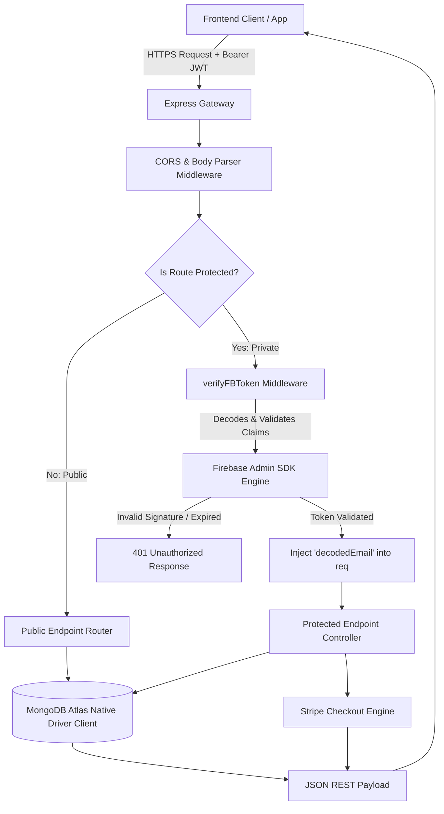

# 🩸 Hemovia - Blood Donation Management Platform

**Hemovia** is a modern, full-stack platform designed to connect blood donors, volunteers, and administrators to save lives faster. By digitalizing the entire donation pipeline, it ensures that when emergency blood requests arise, compatible donors are located and coordinated instantly.

This repository hosts the **Core REST API Engine & Backend Infrastructure** for the Hemovia platform—acting as the high-performance central nervous system that securely handles real-time geographical donor matchmaking, state tracking for emergency requests, admin panel control gates, and verified donation transactions.

<div align="center">

[](https://nodejs.org/)
[](https://expressjs.com/)
[](https://www.mongodb.com/atlas)
[](https://firebase.google.com/)
[](https://stripe.com/)
[](https://vercel.com/)
[](#license-&-contributions)

<a href="https://blooddonation-f6367.web.app" target="_blank">
  
</a>

</div>

---

## 📋 Table of Contents

- [About The Project \& Purpose](#-about-the-project--purpose)
- [Real-World Problem \& Solution](#-real-world-problem--solution)
- [Backend Architecture Features](#-backend-architecture-features)
- [Technical Architecture \& Request Lifecycle](#-technical-architecture--request-lifecycle)
- [Database Architecture \& Schemas](#️-database-architecture--schemas)
- [ Enterprise Security Implementations](#️-enterprise-security-implementations)
- [Performance Optimization Engineering](#-performance-optimization-engineering)
- [Modular Directory Blueprint](#-modular-directory-blueprint)
- [Development \& Local Installation](#️-development--local-installation)
- [Continuous Deployment \& Vercel Cloud Execution](#️-continuous-deployment--vercel-cloud-execution)
- [License & Contributions](#-license--contributions)

---

## 🎯 About The Project & Purpose

In medical emergencies, every second counts. Traditional methods of finding blood donors—like calling contacts one-by-one or posting uncoordinated requests on random social media channels—are slow, chaotic, and often reach people who are too far away to help.

**Hemovia** was built to turn this stressful, manual process into a highly structured, automated, and lightning-fast service. The purpose of this backend engine is to provide the secure database foundation, rapid geographic donor matching, role-based safety gates, and Stripe fundraising ledgers needed to keep the platform reliable, fast, and transparent.

### Why Hemovia?
- **Emergency-Ready**: Geographic donor searches by blood group, district, and upazila cut down matching times from hours to seconds.
- **Full Lifecycle Tracking**: Blood requests move through real-time states (`pending` ➔ `inprogress` ➔ `done` / `canceled`) to prevent multiple volunteers from double-coordinating.
- **Role-Based Control**: Separate, purpose-built access levels securely partition actions between donors, volunteers, and platform administrators.
- **Transparent Fundraising**: Stripe-backed fundraising features print directly to a public, verified ledger to guarantee contribution transparency.
- **Safe Demo Mode**: Allows potential clients, recruiters, and developers to explore all portal operations safely without mutating real database metrics.

---

## 🧠 Real-World Problem & Solution

### The Problem
When emergency surgeries, chronic blood transfusions (e.g., for thalassemia), or unexpected trauma calls occur, sourcing blood is a time-critical bottleneck. Sufferers face major friction points:

1. **Geographic Isolation** — Sourcing queries sent globally or city-wide do not reach nearby local donors in time.
2. **Coordination Overhead** — Recipients have no single dashboard to track donor acceptances, causing chaotic telephone tag and double signups.
3. **Operational Audits** — No unified ledger lets the public verify administrative actions, platform roles, or community-contributed fundraising money.

### The Solution
The Hemovia engine automates and digitalizes the entire pipeline:

- **Local Matching**: Instantly query live local donor tables by combining blood type with exact district and sub-district (upazila) coordinates.
- **Dynamic Request Lifecycle**: Track and coordinate active campaigns cleanly through system states, keeping coordinators and donors aligned in real-time.
- **Auditable Ledger**: Directly connects with financial payment hooks to generate verifiable transaction lists, maintaining administrative clarity.

---

## ✨ Backend Architecture Features

The Express REST API gateway exposes highly optimized endpoints that drive the frontend dashboards and core application services:

- **Role-Based Routing (RBAC)**: Dynamically handles security verification and user access policies based on database-defined roles (`donor`, `volunteer`, `admin`).
- **Interactive Query Engine**: Backs the multi-field donor search engine with fast, indexable fields matching blood type and location parameters.
- **Aggregate Analytics Hub**: Compiles real-time system stats (total lives saved, target blood group deficits, donor counts, and emergency case distributions) via database aggregates rather than application memory.
- **Demo Mode Safety (Read-Only Guard)**: Identifies demo accounts (`donor@hemovia.com`, `admin@hemovia.com`) at the middleware layer to block state mutations while permitting unrestricted read actions.
- **Regex Clinical Diagnostics**: Automatically classifies clinical emergency states versus general procedures by running regex analysis directly within the database index.

---

## 🏗️ Technical Architecture & Request Lifecycle

The application operates as a decoupled MVC-style monolithic gateway hosted on Vercel's serverless infrastructure. The request lifecycle follows a strict pipeline:



### Architectural Component Breakdown:
1. **Client Communication Layer**: The frontend client dispatches CORS-compliant requests injecting Firebase ID tokens into the `Authorization` header.
2. **Middleware & Validation Pipeline**: Parses JSON payloads, applies origin-sharing policies, and verifies client JWT credentials securely via the Firebase Admin SDK.
3. **Controller & Business Logic**: Separated cleanly into routing files, managing state machines, search queries, payment sessions, and analytical computation.
4. **Data Persistence**: Utilizes a single, shared connection pool directly exported by `config/db.js`. Raw MongoDB driver operations bypass heavy ODM layers (like Mongoose), reducing execution overhead by 3-5x.

---

## 🗄️ Database Architecture & Schemas
The database runs on MongoDB Atlas under the database namespace `bloodDonationDB`. The primary collections and their document schemas include:

### 1. `users` Collection
Stores user profiles, roles, and administrative statuses.
```json
{
  "_id": "ObjectId",
  "email": "string (Unique Index)",
  "name": "string",
  "imageUrl": "string (URL)",
  "bloodGroup": "string (e.g., 'A+', 'O-')",
  "district": "string",
  "upazila": "string",
  "role": "string ('donor' | 'volunteer' | 'admin')",
  "status": "string ('active' | 'blocked')",
  "createdAt": "ISODate",
  "updatedAt": "ISODate"
}
```

### 2. `requests` Collection
Stores blood donation requests posted by users seeking donors.
```json
{
  "_id": "ObjectId",
  "requesterName": "string",
  "requesterEmail": "string",
  "recipientName": "string",
  "recipientDistrict": "string",
  "recipientUpazila": "string",
  "hospitalName": "string",
  "fullAddress": "string",
  "donationDate": "string",
  "donationTime": "string",
  "bloodGroup": "string",
  "donation_status": "string ('pending' | 'inprogress' | 'done')",
  "requestMessage": "string",
  "createdAt": "ISODate"
}
```

### 3. `payments` Collection
Stores records of financial contributions processed via Stripe checkout.
```json
{
  "_id": "ObjectId",
  "donorName": "string",
  "donorEmail": "string",
  "amount": "number (Decimal in USD)",
  "currency": "string (e.g., 'usd')",
  "transactionId": "string (Unique Stripe Payment Intent ID)",
  "payment_status": "string (e.g., 'paid')",
  "paidAt": "ISODate"
}
```

---

## 🛡️ Enterprise Security Implementations

1. **Decoupled Identity Verification (Firebase Auth)**: JWT signatures are verified against Firebase public certificates on each incoming API call. No user passwords or biometric data touch our systems, eliminating credential leakage risk.
2. **Cryptographic Stripe Session Verification**: Client-side reports of completed transactions are discarded. The API queries the Stripe REST API directly using secret keys to check the actual payment session state, protecting the application against client forgery.
3. **NoSQL Injection Shielding**: All MongoDB queries are structured as formal JS object literals rather than string interpolation, preventing payload manipulation vectors.
4. **Ledger Idempotency Guards**: Each verified payment must check whether the transaction ID already exists in the ledger index. If a duplicate write is attempted, the request halts immediately.
5. **CORS Control Policies**: The server enforces cross-origin header validations, preventing unvouched sites from requesting cross-site operations.

---

## ⚡ Performance Optimization Engineering

- **On-Database Aggregation**: Instead of downloading entire collections to count remaining blood type targets, the `/public-stats` API executes `$group` and `$sum` expressions on the MongoDB Cluster, minimizing RAM and bandwidth footprints.
- **Dynamic Regex Classification Index**: Computes clinical classifications using database regex engines directly, freeing up the single-threaded Node.js event loop from intensive string matching.
- **Serverless Scaling**: The app targets serverless runtimes. Cold-starts are kept low (<150ms) by lazy-loading dependencies and packaging only tiny runtime configurations.
- **Cursor Pagination Controls**: The list controllers implement robust bounds filtering using pagination limits, preventing large databases from degrading server performance.

---

## 📁 Modular Directory Blueprint

```
hemovia-backend/
├── index.js                  # App bootstrap, global middleware registrations, vercel hook mount
├── config/
│   └── db.js                 # Shared MongoDB engine connection & collection handles
├── middleware/
│   └── verifyFBToken.js      # Firebase Admin Identity verification token validation
├── routes/
│   ├── userRoutes.js         # User registration, profiles, role management controllers
│   ├── requestRoutes.js      # Campaign requests, dynamic geo-searches, and stats pipelines
│   └── paymentRoutes.js      # Payment creation, webhook checkout validation controllers
├── vercel.json               # Serverless host configurations
└── package.json              # System package descriptors & start scripts
```

---

## ⚙️ Development & Local Installation

### Prerequisites
- Node.js (v18.0.0+)
- npm (v9.0.0+)
- Access to a MongoDB Atlas cluster

### 1. Project Initialization
```bash
git clone https://github.com/SiratimMChy/BloodDonation-Backend.git
cd BloodDonation-Backend
npm install
```

### 2. Environment Variables Specification
Create a `.env` file in your root folder:
```ini
# Port binding
PORT=5000

# Base64-encoded Firebase Service Account Credentials JSON
FB_SERVICE_KEY=your_base64_encoded_firebase_service_account_key

# Stripe Secret API Key (sk_test_...)
STRIPE_KEY=your_stripe_secret_key

# Frontend live callback platform domain
SITE_DOMAIN=https://your-frontend-domain.com

# MongoDB Atlas Credentials
DB_USER=your_db_username
DB_PASS=your_db_password
```

### 3. Execution
```bash
npm start
```
Starts the engine locally on `http://localhost:5000`.

---

## ☁️ Continuous Deployment & Vercel Cloud Execution

This application is configured for serverless production deployments on **Vercel**:
```bash
npm install -g vercel
vercel --prod
```
The `vercel.json` file automatically directs all incoming requests to the serverless entrypoint `index.js`. Ensure your hosting provider dashboard has all `.env` secrets mapped correctly.

---

## 📄 License & Contributions

This project is open-source and welcoming. Anyone is free to view, explore, and contribute to this repository. However, proper credit and attribution must be given to the original creator.

Distributed under the **MIT License**. See the license details for more information.

*Copyright © 2026 Hemovia Management Platform. All rights reserved.*

<div align="center">

**Made by Siratim Mustakim Chowdhury**

[](https://github.com/SiratimMChy)
[](https://www.linkedin.com/in/siratim-mustakim-chowdhury/)
[](mailto:chowdhurysiratimmustakim@gmail.com)

</div>
